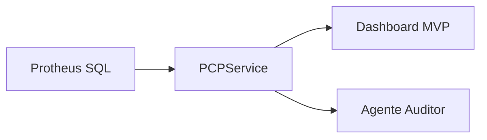

# Arquitetura mínima - PCP Shadow

## Objetivo
Disponibilizar visibilidade em tempo real do PCP sem depender do módulo padrão do Protheus, mantendo o Protheus como sistema de registro e evitando escrita direta no banco.

## Componentes (MVP)
1. **Leitura direta do banco (SQL Server/Oracle)**
   - Consultas de estoque, carteira e OPs com filtro `D_E_L_E_T_ = ''`.
   - Tabelas com sufixo de empresa (ex: `SC2010`, `SB2010`).
2. **Serviço de dados (Python)**
   - `PCPService` encapsula as queries.
   - Saída em JSON/dicionários para consumir em dashboards e agentes.
3. **Dashboard MVP (Streamlit)**
   - Painéis de estoque, carteira, OPs em aberto e alertas rápidos.
4. **Agente Auditor**
   - Identifica anomalias (ex: OP encerrada sem consumo).
   - Envia alertas para responsáveis antes de rodar o PCP.
5. **Configuração**
   - Variáveis de ambiente em `.env` (ver `.env.example`).

## Fluxo de dados

## Evolução sugerida
1. **Alertas operacionais**: alertas em Teams/Email/Telegram.
2. **Simulador de cenários**: cálculo de disponibilidade futura (estoque + OPs - carteira).
3. **Escrita segura**: integração via API REST/ADVPL para apontamentos e baixas.

> Nota: esta versão consolida a resolução dos conflitos apontados no PR.
