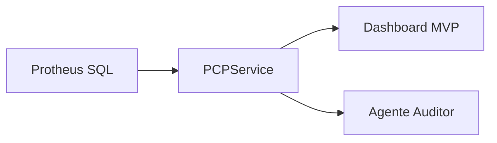

# Arquitetura mínima - PCP Shadow

## Objetivo
Disponibilizar visibilidade em tempo real do PCP sem depender do módulo padrão do Protheus, mantendo o Protheus como sistema de registro e evitando escrita direta no banco.

## Alinhamento ao Protheus (PCP e Comercial)
- **SB1**: cadastro de produto; **B1_DESC** = descrição; normalização por B1_COD (cadastro único ou por filial).
- **SB2**: saldos por armazém (estoque atual, reserva, local).
- **SC2**: ordens de produção (PCP); C2_QUANT/C2_QUJE = original/produzido; **C2_STATUS**: N=Liberada, E=Encerrada; **StatusOPDescricao** e **ApontadoParcial**/**ApontadoTotal** para análise de ganho/perda.
- **SC5/SC6**: pedidos de venda. **Carteira** = itens com saldo a entregar; **C5_VEND** + **SA3** = vendedor de origem; **C6_NOTA**/C6_SERIE = NF emitida; **EntregaParcial** = corte no carregamento (QTDENT < QTDVEN).
- **Coleta e Entrega (TOTVS)**: **DAI** = itens da carga (DAI_PEDIDO, DAI_DTCHEG = data chegada); **DAK** = cargas (DAK_FEZNF = gerou NF). **TemRomaneioCarga** e **StatusEntrega** (Pendente | Com romaneio/carga | NF emitida | Entrega realizada) vêm dessas amarrações. Se o módulo não estiver em uso, a query da Carteira pode falhar (tabelas DAI/DAK); ajustar ou desativar o uso de DAI nesse caso.

## Componentes (MVP)
1. **Leitura direta do banco (SQL Server)**
   - Consultas de estoque, carteira e OPs com filtro `D_E_L_E_T_ = ''`.
   - Tabelas com sufixo de empresa (ex: `SC2010`, `SB2010`, `SB1010`).
   - Descrição do produto (SB1.B1_DESC) incluída nas listagens para facilitar leitura.
2. **Serviço de dados (Python)**
   - `PCPService` encapsula as queries.
   - Saída em JSON/dicionários para consumir em dashboards e agentes.
3. **Dashboard MVP (Streamlit)**
   - Painéis de estoque, carteira, OPs em aberto e alertas rápidos.
4. **Agente Auditor**
   - Identifica anomalias (ex: OP encerrada sem consumo).
   - Envia alertas para responsáveis antes de rodar o PCP.
5. **Configuração**
   - Variáveis de ambiente em `.env` (ver `.env.example`).

## Fluxo de dados

## Explorador de tabelas (diagnóstico)
Execute `python -m backend.run_explore` (na pasta `mypcpweb`) para rodar **TOP 10** em SB1, SB2, SC2, SC5, SC6, SF2, SD2, SA1. Use para:
- Ver por que a descrição do produto (B1_DESC) vem vazia: conferir B1_FILIAL e amostra de B1_DESC.
- Validar nomes de colunas (ex.: data de entrega em SC6 pode ser **C6_ENTREG** ou **C6_ENTREGA** conforme a base).
- Entender vínculo pedido → NF (C6_NOTA, SF2, SD2) para regras da Carteira.

Opção: `python -m backend.run_explore --file saida.txt` grava o resultado em arquivo.

## Evolução sugerida
1. **Alertas operacionais**: alertas em Teams/Email/Telegram.
2. **Simulador de cenários**: cálculo de disponibilidade futura (estoque + OPs - carteira).
3. **Escrita segura**: integração via API REST/ADVPL para apontamentos e baixas.

> Nota: esta versão consolida a resolução dos conflitos apontados no PR.
