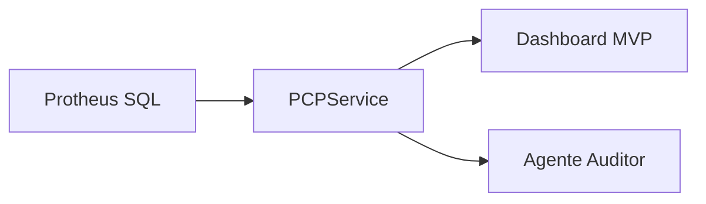

# Arquitetura Backend (fase atual)

## Premissas
- PCP em `PCP_DB` (schema `pcp`).
- Protheus sem REST disponível (uso de SQL fallback read-only).
- Motor de cálculo no backend FastAPI.

## Componentes (MVP)
1. **Leitura direta do banco (SQL Server/Oracle)**
   - Consultas de estoque, carteira e OPs com filtro `D_E_L_E_T_ = ''`.
   - Tabelas com sufixo de empresa (ex: `SC2010`, `SB2010`).
   - Descrição do produto (`SB1.B1_DESC`) incluída nas listagens para facilitar leitura.
2. **Serviço de dados (Python)**
   - `PCPService` encapsula as queries.
   - Saída em JSON/dicionários para consumir em dashboards e agentes.
3. **Dashboard MVP (Streamlit)**
   - Painéis de estoque, carteira, OPs em aberto e alertas rápidos.
4. **Agente Auditor**
   - Identifica anomalias (ex: OP encerrada sem consumo).
   - Envia alertas para responsáveis antes de rodar o PCP.
5. **Configuração**
   - Variáveis de ambiente em `.env` (ver `.env.example`).

## Componentes (API de planejamento)
- `backend/adapters/protheus_sql_adapter.py`: leitura de itens/estoque do Protheus via SQL.
- `backend/api/routes/stock.py`: snapshot para `pcp.plan_stock_snapshot`.
- `backend/api/routes/mrp.py`: PARTE A (`/calc-production`) e PARTE B (`/explode-mrp`).
- `backend/api/services/planning_service.py`: cálculo determinístico da produção requerida.
- `backend/api/services/mrp_*`: explosão e consolidação de materiais.

## Fluxo de dados

## Fluxo (API)
1. `POST /plans`
2. `POST /plans/{id}/snapshot-stock`
3. `POST /plans/{id}/calc-production`
4. `POST /plans/{id}/explode-mrp`

## Explorador de tabelas (diagnóstico)
Execute `python -m backend.run_explore` (na pasta `mypcpweb`) para rodar **TOP 10** em SB1, SB2, SC2, SC5, SC6, SF2, SD2 e SA1. Use para:
- Ver por que a descrição do produto (B1_DESC) vem vazia: conferir `D_E_L_E_T_` e amostra de B1_DESC.
- Validar nomes de colunas (ex.: data de entrega em SC6 pode ser **C6_ENTREG** ou **C6_ENTREGA** conforme a base).
- Entender vínculo pedido → NF (C6_NOTA, SF2, SD2) para regras da Carteira.

Opção: `python -m backend.run_explore --file saida.txt` grava o resultado em arquivo.

## Evolução sugerida
1. **Alertas operacionais**: alertas em Teams/Email/Telegram.
2. **Simulador de cenários**: cálculo de disponibilidade futura (estoque + OPs - carteira).
3. **Escrita segura**: integração via API REST/ADVPL para apontamentos e baixas.
